# 自定义图表功能使用指南

## 功能概述

在大纲模块中，除了自动生成的图表，你现在可以创建和编辑自定义的 Mermaid 和 PlantUML 图表。

## 功能特点

✅ **实时预览** - 边编辑边查看效果
✅ **代码编辑器** - 支持 Mermaid 和 PlantUML 语法
✅ **预设模板** - 快速开始，无需从零编写
✅ **多视图模式** - 代码、预览、分屏三种模式
✅ **保存管理** - 保存自定义图表，随时查看和编辑

## 使用步骤

### 1. 创建自定义图表

1. 进入大纲视图
2. 切换到"图表"标签
3. 点击右上角的"**+ 自定义图表**"按钮
4. 图表编辑器对话框打开

### 2. 选择图表类型

在编辑器顶部选择：
- **Mermaid** - 纯前端渲染，默认可用
- **PlantUML** - 需要配置 Kroki 服务器

### 3. 使用预设模板（可选）

点击"模板"下拉菜单，选择一个预设模板：

#### Mermaid 模板
- 简单流程图
- 三幕结构
- 角色关系网
- 故事时间线

#### PlantUML 模板
- 组件图
- 时序图

### 4. 编辑代码

在左侧编辑器中输入或修改代码：

#### Mermaid 示例
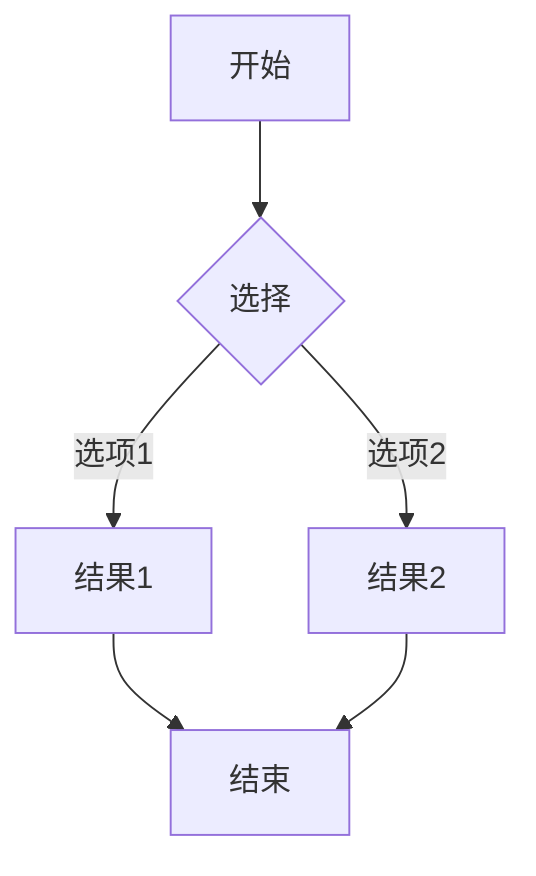

#### PlantUML 示例
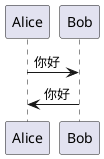

### 5. 实时预览

右侧会实时显示图表效果。

### 6. 切换视图模式

使用顶部的视图切换按钮：
- 📝 **代码模式** - 只显示编辑器
- 📄 **分屏模式** - 同时显示代码和预览
- 👁️ **预览模式** - 只显示预览

### 7. 保存图表

点击"**保存**"按钮，图表会添加到标签栏中。

## 管理自定义图表

### 查看图表
在标签栏中点击自定义图表的标签即可查看。

### 编辑图表
1. 切换到要编辑的图表
2. 点击下方的"**编辑**"按钮
3. 在编辑器中修改
4. 保存更新

### 删除图表
1. 切换到要删除的图表
2. 点击下方的"**删除**"按钮
3. 确认删除

## Mermaid 语法快速参考

### 流程图
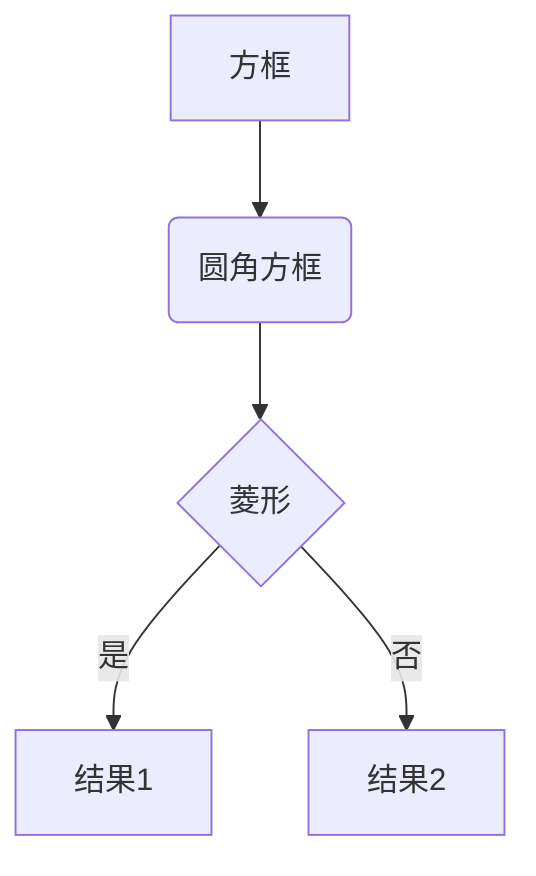

### 时序图
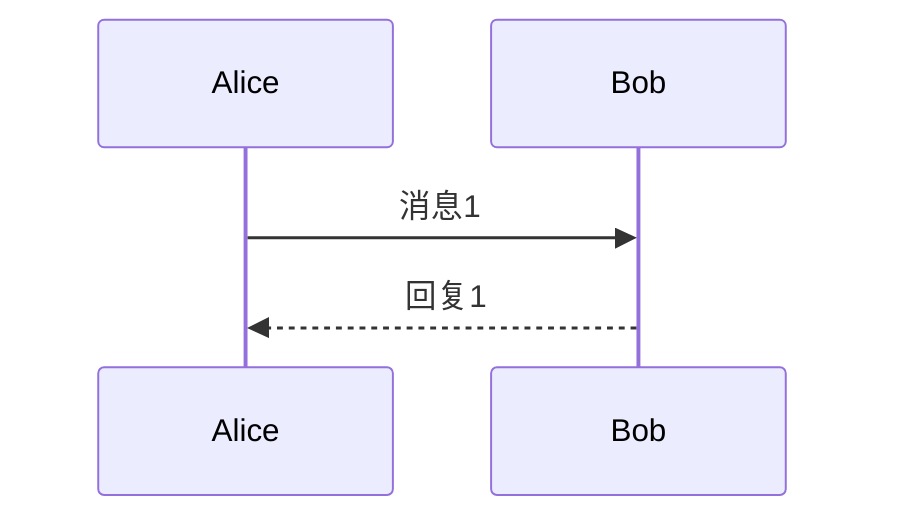

### 甘特图
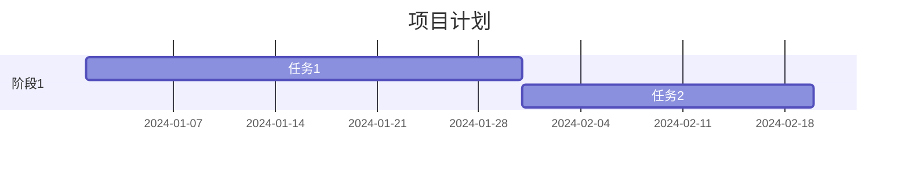

### 类图
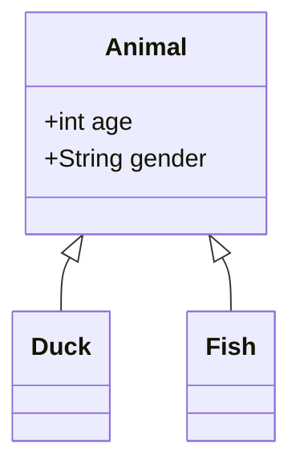

## PlantUML 语法快速参考

### 时序图
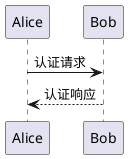

### 用例图
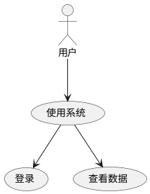

### 类图
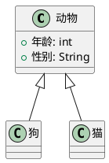

### 组件图
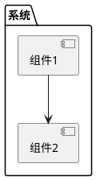

## 使用场景

### 1. 故事结构规划
使用流程图展示故事的分支走向。

### 2. 角色关系图
使用网络图展示复杂的角色关系。

### 3. 时间线
使用甘特图或时间线图展示故事发展。

### 4. 场景流转
使用状态图展示场景之间的转换。

### 5. 剧情分析
使用思维导图分析剧情要素。

## 技巧与建议

### 1. 从模板开始
不熟悉语法时，先选择一个模板，然后修改。

### 2. 使用分屏模式
编辑时使用分屏模式，可以实时看到效果。

### 3. 保持简洁
图表不要太复杂，否则难以阅读。

### 4. 使用注释
在代码中添加注释，方便以后修改：
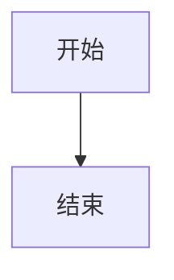

### 5. 导出图表
使用查看器的导出功能，将图表保存为 SVG 或 PNG。

## 常见问题

### Q: Mermaid 和 PlantUML 有什么区别？
A: 
- Mermaid 是纯前端渲染，无需配置，语法简单
- PlantUML 功能更强大，但需要配置服务器

### Q: 如何学习更多语法？
A: 
- Mermaid: https://mermaid.js.org/
- PlantUML: https://plantuml.com/

### Q: 图表渲染失败怎么办？
A: 
1. 检查语法是否正确
2. 查看错误提示
3. 尝试使用预设模板
4. 如果是 PlantUML，检查 Kroki 服务器配置

### Q: 可以导入外部图表吗？
A: 
目前支持复制粘贴代码。未来会添加导入功能。

### Q: 自定义图表会保存吗？
A: 
当前会话中会保存。未来会添加持久化存储。

## 快捷键

- `Ctrl/Cmd + S` - 保存图表
- `Ctrl/Cmd + Z` - 撤销
- `Ctrl/Cmd + Y` - 重做
- `Esc` - 关闭编辑器

## 更新日志

### v1.0.0
- ✅ 基础编辑器功能
- ✅ Mermaid 支持
- ✅ PlantUML 支持
- ✅ 预设模板
- ✅ 实时预览
- ✅ 多视图模式

## 反馈与建议

如果你有任何建议或发现问题，欢迎反馈！
