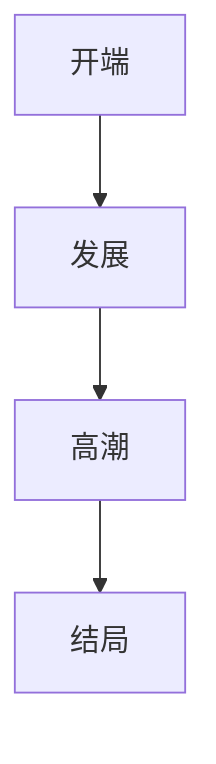
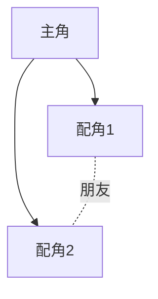
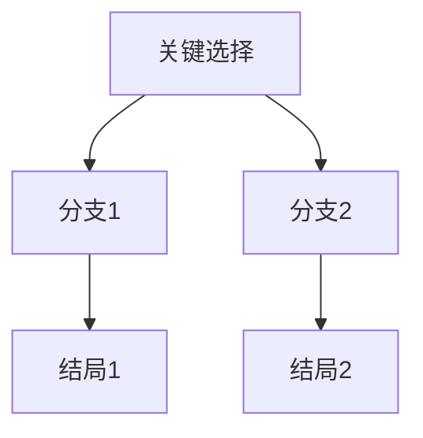
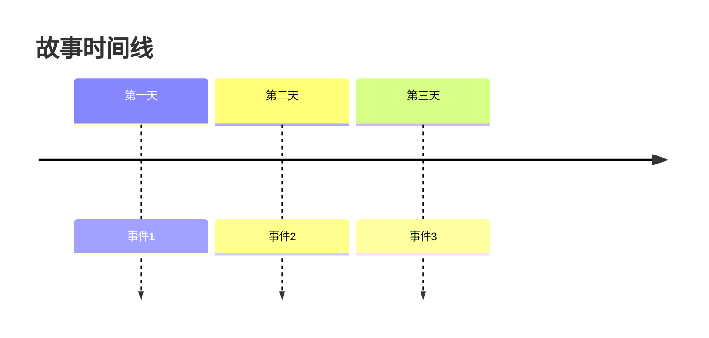
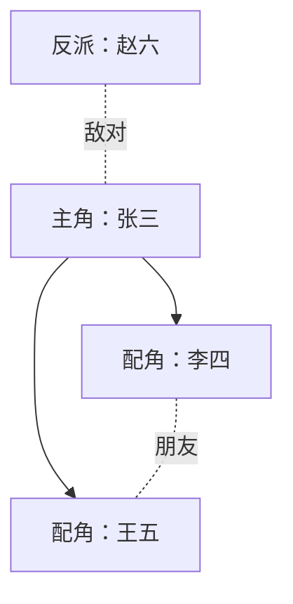
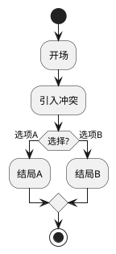

# ✅ 自定义图表功能实现完成

## 🎉 功能概述

在大纲模块中添加了自定义图表编辑功能，用户可以通过编辑 Mermaid 和 PlantUML 代码来创建自定义图表。

## 📦 新增文件

### 1. 图表编辑器组件
**文件**: `src/components/outline/diagram-editor.tsx`

**功能**:
- 代码编辑器（Textarea）
- 实时预览
- 类型切换（Mermaid/PlantUML）
- 预设模板选择
- 视图模式切换（代码/分屏/预览）
- 保存和重置功能

### 2. 图表编辑器对话框
**文件**: `src/components/outline/diagram-editor-dialog.tsx`

**功能**:
- 对话框封装
- 全屏编辑体验
- 保存回调处理

### 3. 图表预设模板
**文件**: `src/lib/diagram-presets.ts`（已存在，已扩展）

**内容**:
- Mermaid 预设模板
- PlantUML 预设模板
- 模板分类和查询

### 4. 使用指南
**文件**: `自定义图表功能使用指南.md`

**内容**:
- 完整的使用说明
- 语法快速参考
- 使用场景示例
- 常见问题解答

## 🎯 核心功能

### 1. 图表编辑器

```typescript
<DiagramEditor
  initialCode={code}
  initialType="mermaid"
  onSave={(code, type) => {
    // 保存逻辑
  }}
/>
```

**特性**:
- 支持 Mermaid 和 PlantUML
- 实时预览
- 预设模板
- 三种视图模式

### 2. 自定义图表管理

**创建**:
- 点击"+ 自定义图表"按钮
- 在编辑器中编写代码
- 保存后自动添加到标签栏

**编辑**:
- 点击图表下方的"编辑"按钮
- 修改代码
- 保存更新

**删除**:
- 点击图表下方的"删除"按钮
- 确认删除

### 3. 视图模式

- **代码模式** - 专注编辑
- **分屏模式** - 边编辑边预览
- **预览模式** - 专注查看效果

### 4. 预设模板

#### Mermaid 模板
- 简单流程图
- 三幕结构
- 角色关系网
- 故事时间线

#### PlantUML 模板
- 组件图
- 时序图

## 🎨 UI/UX 设计

### 编辑器布局

```
┌─────────────────────────────────────────┐
│  类型选择  │  模板选择  │  视图模式  │  操作  │
├─────────────────────────────────────────┤
│                                         │
│  代码编辑器        │      预览区域      │
│                   │                    │
│                   │                    │
│                   │                    │
└─────────────────────────────────────────┘
```

### 标签栏集成

```
[结构图] [流程图] [三幕结构] ... [自定义图表1] [+ 自定义图表]
```

## 💡 使用场景

### 1. 故事结构规划


### 2. 角色关系图


### 3. 剧情分支


### 4. 时间线


## 🔧 技术实现

### 状态管理

```typescript
const [customDiagrams, setCustomDiagrams] = useState<CustomDiagram[]>([]);
const [editingDiagram, setEditingDiagram] = useState<CustomDiagram | null>(null);
const [editorOpen, setEditorOpen] = useState(false);
```

### 数据结构

```typescript
interface CustomDiagram {
  id: string;
  name: string;
  code: string;
  type: "mermaid" | "plantuml";
}
```

### 保存逻辑

```typescript
const handleSaveCustomDiagram = (code: string, type: "mermaid" | "plantuml") => {
  if (editingDiagram) {
    // 更新现有图表
    setCustomDiagrams(prev =>
      prev.map(d => d.id === editingDiagram.id ? { ...d, code, type } : d)
    );
  } else {
    // 创建新图表
    const newDiagram: CustomDiagram = {
      id: `custom-${Date.now()}`,
      name: `自定义图表 ${customDiagrams.length + 1}`,
      code,
      type,
    };
    setCustomDiagrams(prev => [...prev, newDiagram]);
  }
};
```

## 📊 功能对比

| 功能 | 自动生成图表 | 自定义图表 |
|------|-------------|-----------|
| 数据来源 | 章节/场景数据 | 用户编写 |
| 灵活性 | 固定格式 | 完全自定义 |
| 使用难度 | 简单 | 需要学习语法 |
| 适用场景 | 快速查看 | 特殊需求 |

## 🚀 未来优化

### 短期（1-2周）
- [ ] 图表重命名
- [ ] 图表排序
- [ ] 代码语法高亮
- [ ] 错误提示优化

### 中期（1个月）
- [ ] 持久化存储（保存到数据库）
- [ ] 图表导入/导出
- [ ] 代码片段库
- [ ] 协作分享

### 长期（3个月+）
- [ ] AI 辅助生成
- [ ] 可视化编辑器
- [ ] 图表动画
- [ ] 版本历史

## 📝 使用示例

### 创建角色关系图

1. 点击"+ 自定义图表"
2. 选择"Mermaid"类型
3. 选择"角色关系网"模板
4. 修改代码：



5. 点击"保存"

### 创建剧情流程

1. 点击"+ 自定义图表"
2. 选择"PlantUML"类型
3. 输入代码：



4. 点击"保存"

## ✅ 测试清单

- [x] Mermaid 图表渲染
- [x] PlantUML 图表渲染
- [x] 预设模板加载
- [x] 视图模式切换
- [x] 保存功能
- [x] 编辑功能
- [x] 删除功能
- [x] 实时预览
- [x] 错误处理

## 📚 参考资源

- Mermaid 文档: https://mermaid.js.org/
- PlantUML 文档: https://plantuml.com/
- 使用指南: `自定义图表功能使用指南.md`

## 🎊 总结

自定义图表功能为用户提供了更大的灵活性，可以根据自己的需求创建各种类型的图表。结合自动生成的图表，用户可以全方位地可视化和分析小说大纲。

**核心价值**:
- 🎨 创意自由 - 不受限于预设格式
- 📊 可视化增强 - 更直观地展示想法
- 🔧 工具完善 - 编辑器功能齐全
- 📖 易于学习 - 预设模板降低门槛
