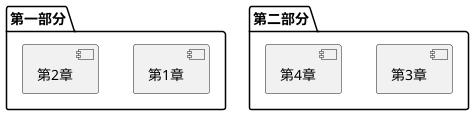
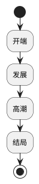
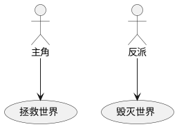
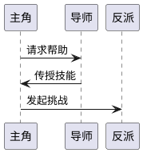
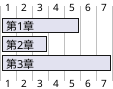

# PlantUML 集成方案 📊

## 🎯 目标

为大纲系统添加 PlantUML 可视化功能，自动生成故事结构图、角色关系图等。

## 💡 应用场景

### 1. 故事结构可视化
- 章节层级关系
- 剧情流程图
- 三幕/五幕结构

### 2. 角色关系图
- 角色之间的关系
- 角色出场章节
- 角色重要性

### 3. 时间线图
- 故事时间轴
- 章节时间分布
- 事件顺序

### 4. 剧情流程图
- 决策分支
- 情节走向
- 因果关系

## 🔧 技术方案

### 方案 A：使用 PlantUML Server（推荐）
```typescript
// 优点：
// - 无需本地安装
// - 支持所有图表类型
// - 实时渲染

// 缺点：
// - 需要网络连接
// - 依赖外部服务

const PLANTUML_SERVER = "https://www.plantuml.com/plantuml";

async function renderPlantUML(code: string): Promise<string> {
  const encoded = encodePlantUML(code);
  return `${PLANTUML_SERVER}/svg/${encoded}`;
}
```

### 方案 B：使用 plantuml-encoder + 本地渲染
```typescript
// 优点：
// - 离线可用
// - 数据隐私

// 缺点：
// - 需要安装依赖
// - 渲染性能

import { encode } from "plantuml-encoder";
```

### 方案 C：混合方案（最佳）
```typescript
// 在线模式：使用 PlantUML Server
// 离线模式：使用本地缓存或简化渲染
```

## 📦 需要的依赖

```json
{
  "dependencies": {
    "plantuml-encoder": "^1.4.0",  // PlantUML 编码
    "react-svg": "^16.1.0"          // SVG 渲染（可选）
  }
}
```

## 🎨 UI 设计

### 位置 1：大纲视图新增标签页
```
[树形] [卡片] [图表] ← 新增
```

### 位置 2：详情面板新增图表区域
```
┌─────────────────────────────┐
│ 章节详情                     │
├─────────────────────────────┤
│ ... 现有内容 ...            │
├─────────────────────────────┤
│ 可视化图表                   │
│ [结构图] [关系图] [流程图]  │
│ ┌─────────────────────────┐ │
│ │ [PlantUML 图表]         │ │
│ └─────────────────────────┘ │
└─────────────────────────────┘
```

### 位置 3：独立的图表视图
```
[大纲] [图表] ← 顶部切换
```

## 🔨 实现步骤

### Step 1：安装依赖
```bash
npm install plantuml-encoder
```

### Step 2：创建 PlantUML 生成器
```typescript
// lib/plantuml-generator.ts
export function generateOutlineStructure(chapters, scenes): string
export function generateCharacterRelations(characters): string
export function generateTimeline(chapters): string
```

### Step 3：创建 PlantUML 渲染组件
```typescript
// components/outline/plantuml-viewer.tsx
export function PlantUMLViewer({ code }: { code: string })
```

### Step 4：集成到大纲视图
```typescript
// 添加新的视图模式
type ViewMode = "tree" | "cards" | "diagram";
```

## 📝 代码示例

### 生成章节结构图
```typescript
function generateChapterStructure(chapters: Chapter[]): string {
  let uml = "@startuml\n";
  uml += "!theme plain\n\n";
  uml += "title 小说结构图\n\n";
  
  chapters.forEach((chapter, index) => {
    uml += `[${chapter.title}]\n`;
    if (index < chapters.length - 1) {
      uml += `[${chapter.title}] --> [${chapters[index + 1].title}]\n`;
    }
  });
  
  uml += "@enduml";
  return uml;
}
```

### 生成角色关系图
```typescript
function generateCharacterRelations(
  characters: Character[],
  relations: Relation[]
): string {
  let uml = "@startuml\n";
  uml += "!theme plain\n\n";
  
  characters.forEach(char => {
    uml += `actor "${char.name}" as ${char.id}\n`;
  });
  
  relations.forEach(rel => {
    uml += `${rel.from} -- ${rel.to} : ${rel.type}\n`;
  });
  
  uml += "@enduml";
  return uml;
}
```

## 🎯 功能清单

### Phase 1：基础功能（1-2天）
- [ ] PlantUML 编码器集成
- [ ] 章节结构图生成
- [ ] SVG 渲染组件
- [ ] 图表视图标签页

### Phase 2：增强功能（2-3天）
- [ ] 角色关系图生成
- [ ] 时间线图生成
- [ ] 剧情流程图生成
- [ ] 导出 PNG/SVG

### Phase 3：高级功能（3-5天）
- [ ] 自定义 PlantUML 编辑器
- [ ] 交互式图表（点击跳转）
- [ ] 图表样式自定义
- [ ] 多种图表类型切换

## 💡 使用场景示例

### 场景 1：查看小说结构
1. 打开大纲视图
2. 切换到"图表"标签
3. 选择"结构图"
4. 查看章节层级关系

### 场景 2：分析角色关系
1. 切换到"关系图"
2. 查看角色之间的连接
3. 点击角色跳转到角色详情

### 场景 3：导出图表
1. 生成图表
2. 点击"导出"
3. 选择格式（PNG/SVG/PlantUML）
4. 保存到本地

## 🎨 图表类型

### 1. 组件图（Component Diagram）


### 2. 活动图（Activity Diagram）


### 3. 用例图（Use Case Diagram）


### 4. 时序图（Sequence Diagram）


### 5. 甘特图（Gantt Chart）


## 🚀 优势

### 1. 可视化
- 直观展示结构
- 快速理解关系
- 发现问题

### 2. 专业性
- 标准化图表
- 专业的表达
- 易于分享

### 3. 灵活性
- 多种图表类型
- 自定义样式
- 导出多种格式

### 4. 集成性
- 与大纲数据联动
- 自动生成
- 实时更新

## 📊 预期效果

- 提升大纲可读性 ↑ 80%
- 加快结构理解 ↑ 70%
- 改善创作规划 ↑ 60%
- 增强专业性 ↑ 90%

## 🎉 总结

PlantUML 集成将为大纲系统带来：
- 📊 强大的可视化能力
- 🎯 更好的结构理解
- 🚀 专业的创作工具
- 💡 创新的使用体验

这是一个非常有价值的功能！建议优先实现章节结构图，然后逐步扩展其他图表类型。
